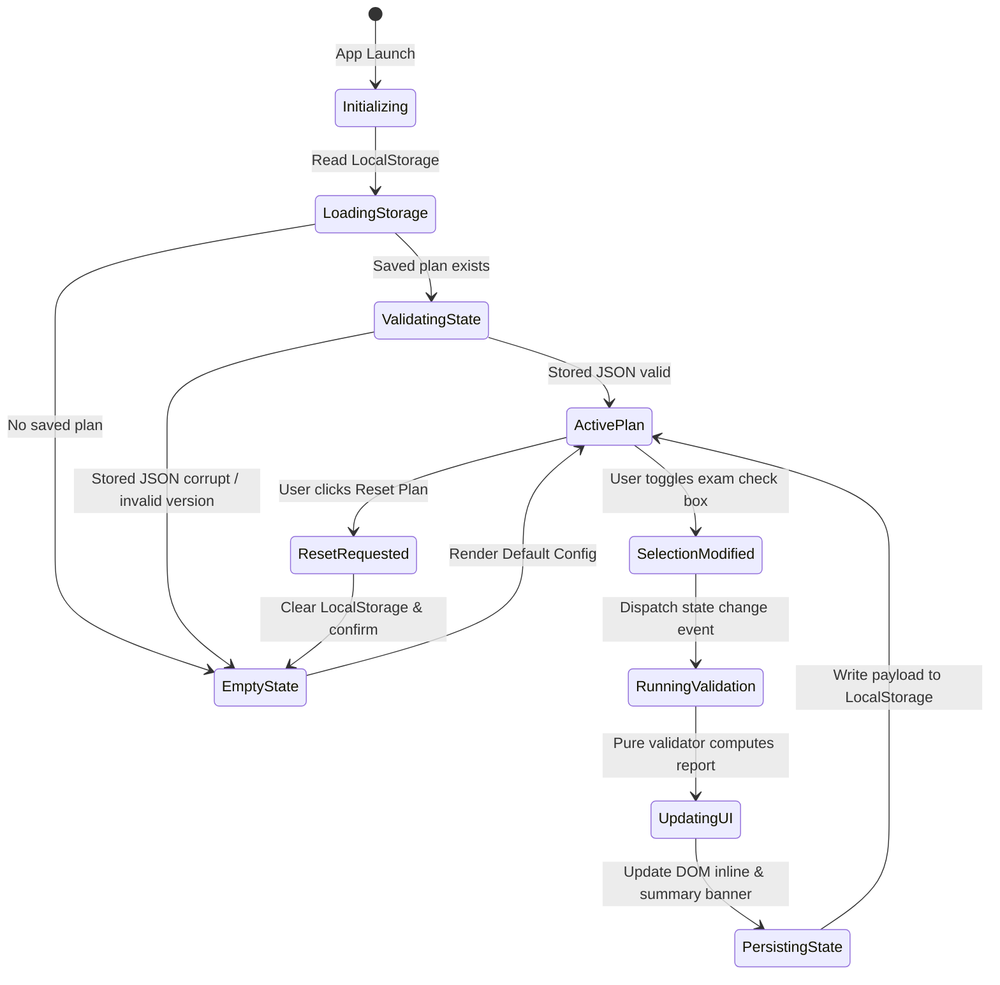

# Data Model & Schema Specification: University Study Plan Compiler

## 1. Domain Entities & Schemas

### 1.1 Curriculum Configuration (`CurriculumConfig`)
The root configuration object loaded from JSON representing degree program rules.

```typescript
interface CurriculumConfig {
  degreeId: string;             // e.g. "computer-science-bsc"
  degreeTitle: string;          // e.g. "Laurea in Informatica"
  academicYear: string;         // e.g. "2025/2026"
  totalRequiredCFU: number;     // e.g. 180 or 120
  tables: CurriculumTable[];    // Array of rule tables
}
```

### 1.2 Curriculum Table (`CurriculumTable`)
Represents a group of exams (e.g. Core Mathematics, Computer Science Electives, Free Choice).

```typescript
interface CurriculumTable {
  id: string;                   // Unique table identifier, e.g., "table-core-math"
  name: string;                 // Display name, e.g., "Attività Formative Base - Matematica"
  description?: string;         // Guidance text for students
  minCFU: number;               // Minimum total CFU required from this table
  maxCFU: number;               // Maximum total CFU allowed from this table
  minExams?: number;            // Optional minimum number of exams
  maxExams?: number;            // Optional maximum number of exams
  isMandatory: boolean;         // True if table requires choices
  exams: ExamOption[];          // List of selectable exam options
  rules?: TableRule[];          // Custom combination or prerequisite rules
}
```

### 1.3 Exam Option (`ExamOption`)
An individual course available within a table.

```typescript
interface ExamOption {
  code: string;                 // Course code, e.g., "INF-01-MATH"
  title: string;                // Course title, e.g., "Analisi Matematica I"
  cfu: number;                  // Credit count, e.g., 6, 9, 12
  ssd?: string;                 // Scientific Disciplinary Sector, e.g., "MAT/05"
  period?: string;              // e.g., "Anno 1 - Semestre 1"
  isCompulsory?: boolean;       // If true, student must select this exam if table is active
}
```

### 1.4 Table Rule (`TableRule`)
Custom rules governing exam combinations.

```typescript
type RuleType = "MUTUALLY_EXCLUSIVE" | "PREREQUISITE" | "REQUIRED_GROUP";

interface TableRule {
  type: RuleType;
  examCodes: string[];          // Codes involved in the rule
  message: string;              // Human-readable error description
}
```

### 1.5 Study Plan State (`StudyPlanState`)
The user's active selections stored in state and LocalStorage.

```typescript
interface StudyPlanState {
  version: string;              // Schema version, e.g., "1.0"
  degreeId: string;             // Active degree ID
  selectedExams: {
    [tableId: string]: string[];// Map of tableId -> array of selected exam codes
  };
  lastSavedAt?: string;         // ISO timestamp
}
```

### 1.6 Validation Report (`ValidationReport`)
Result of running the validation engine over the `StudyPlanState` against `CurriculumConfig`.

```typescript
interface ValidationReport {
  isValid: boolean;
  totalCFU: number;
  requiredCFU: number;
  tableReports: {
    [tableId: string]: TableValidationResult;
  };
  globalErrors: ValidationError[];
}

interface TableValidationResult {
  tableId: string;
  tableName: string;
  selectedCFU: number;
  minCFU: number;
  maxCFU: number;
  isValid: boolean;
  errors: ValidationError[];
}

interface ValidationError {
  id: string;
  type: "DUPLICATE_EXAM" | "CFU_DEFICIT" | "CFU_EXCESS" | "MISSING_MANDATORY" | "RULE_VIOLATION";
  severity: "ERROR" | "WARNING";
  tableId?: string;
  examCodes?: string[];
  message: string;
}
```

---

## 2. State Lifecycle & Transitions


