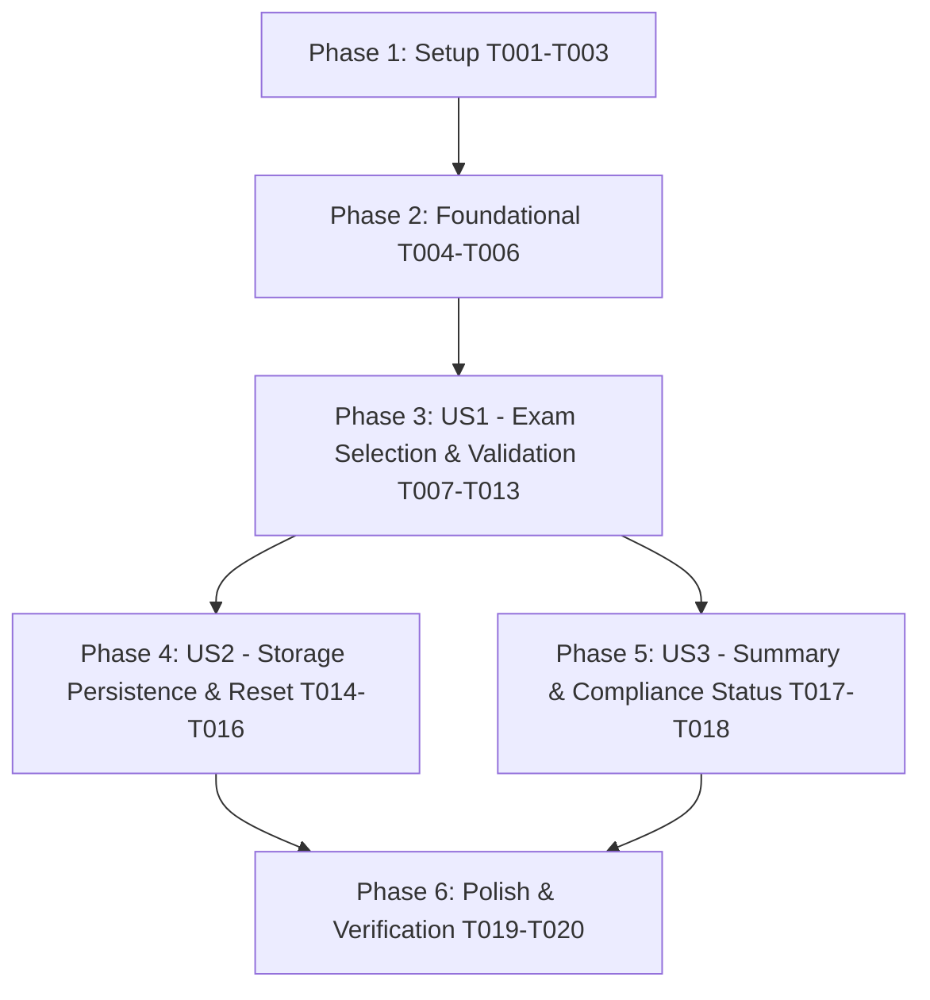

# Tasks: University Study Plan Compiler

**Input**: Design documents from `/specs/001-study-plan-compiler/`
**Prerequisites**: plan.md (required), spec.md (required), research.md, data-model.md, contracts/, quickstart.md

---

## Dependency & Execution Overview



---

## Phase 1: Setup (Shared Infrastructure)

**Purpose**: Initialize Vite environment, directory structure, base HTML layout, and styling design tokens.

- [x] T001 Create project structure and configuration files in package.json and vite.config.js
- [x] T002 Create HTML root layout and application entry point in index.html and src/main.js
- [x] T003 [P] Setup core CSS design tokens, component styles, and responsive layout rules in src/styles/main.css, src/styles/components.css, and src/styles/responsive.css

---

## Phase 2: Foundational (Blocking Prerequisites)

**Purpose**: Core data configuration, state management, and persistence layer required before UI flows.

- [x] T004 Verify curriculum rules dataset structure for Year 2 tables, Year 3 tracks, and Group k in public/data/degree-rules.json
- [x] T005 [P] Implement event-driven reactive state store in src/state/store.js
- [x] T006 [P] Implement LocalStorage wrapper and schema validation in src/storage/persistence.js

---

## Phase 3: User Story 1 - Interactive Exam Selection & Real-Time Validation (Priority: P1) 🎯 MVP

**Goal**: Students can choose Year 2 exams (tables a–e), select a Year 3 specialization track (percorsi Antica, Medievale, Moderna, Contemporanea), pick Year 3 exams (tables g, h, i, j), and complete Group k selections with real-time CFU calculation and instant rule validation.

**Independent Test**: Launch application, select/deselect exams across various tables and tracks, and verify that total CFU updates dynamically while inline errors clearly flag duplicate exams, credit mismatches, cross-year SSD dependencies, and cross-table unicity violations.

### Tests & Core Validation Engine

- [x] T007 [P] [US1] Create unit tests for validation rules (CFU limits, duplicate detection, cross-year SSD dependency, cross-table unicity) in tests/unit/validator.test.js
- [x] T008 [P] [US1] Implement specialized rule checkers (cross-year SSD complement rule, cross-table unicity check) in src/domain/rules.js
- [x] T009 [US1] Implement pure functional validation engine in src/domain/validator.js (depends on T008)

### UI Components & Rendering

- [x] T010 [P] [US1] Create curriculum table component renderer in src/ui/table-component.js
- [x] T011 [P] [US1] Create inline error container and drawer renderer in src/ui/notification.js
- [x] T012 [US1] Implement main form renderer and event binding logic in src/ui/renderer.js (depends on T009, T010, T011)
- [x] T013 [US1] Wire state store, validation engine, and UI renderer together in src/main.js

**Checkpoint**: User Story 1 complete — full interactive study plan compilation with real-time validation is testable.

---

## Phase 4: User Story 2 - Automatic Plan Persistence & Restoration (Priority: P2)

**Goal**: Automatically persist active study plan selections and Year 3 track choice to browser storage on every modification, restore selections on page launch, and provide a plan reset workflow.

**Independent Test**: Select exams, refresh browser tab, verify selections restore; click "Reset Plan", confirm modal, verify plan state clears.

- [x] T014 [P] [US2] Create integration tests for LocalStorage save, reload, and reset in tests/integration/storage.test.js
- [x] T015 [US2] Connect state store auto-save and initial state restoration on app boot in src/state/store.js
- [x] T016 [US2] Implement modal confirmation dialog and plan reset action in src/ui/renderer.js

**Checkpoint**: User Story 2 complete — study plan selections persist safely across browser sessions.

---

## Phase 5: User Story 3 - Curriculum Summary & Export Readiness (Priority: P3)

**Goal**: Display an at-a-glance summary banner showing total CFU breakdown per table, compliance status badge, and clickable links to active errors.

**Independent Test**: Toggle plan selections between compliant and non-compliant states and verify the summary panel updates badge color and displays error jump links.

- [x] T017 [P] [US3] Create summary banner and status badge renderer in src/ui/summary-component.js
- [x] T018 [US3] Integrate summary panel rendering and clickable error jump links in src/ui/renderer.js

**Checkpoint**: All user stories functional.

---

## Phase 6: Polish & Cross-Cutting Concerns

**Purpose**: Accessibility checks, styling refinements, and final empirical quickstart validation.

- [x] T019 [P] Perform accessibility audit (ARIA attributes, keyboard navigation, contrast) in src/styles/main.css and src/ui/table-component.js
- [x] T020 Run end-to-end empirical verification scenarios against specs/001-study-plan-compiler/quickstart.md

---

## Parallel Execution Opportunities

```bash
# Parallel setup & styling:
Task T003: Setup CSS design tokens in src/styles/main.css, components.css, responsive.css
Task T005: Implement reactive state store in src/state/store.js
Task T006: Implement LocalStorage wrapper in src/storage/persistence.js

# Parallel User Story 1 development:
Task T007: Unit tests for validator in tests/unit/validator.test.js
Task T008: Implement rule checkers in src/domain/rules.js
Task T010: Curriculum table renderer in src/ui/table-component.js
Task T011: Notification drawer renderer in src/ui/notification.js
```
